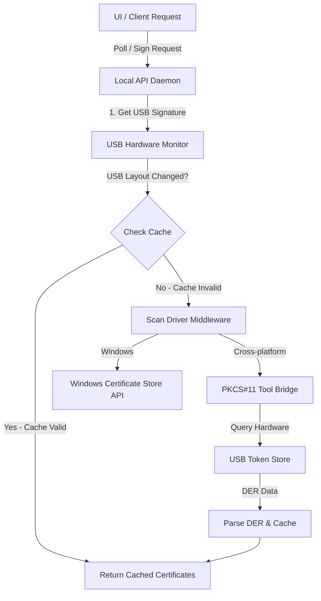

# Technical Reference: USB CA & Hardware Token Detection

This document acts as a permanent technical guide for developers maintaining or upgrading the USB CA/Token detection engine in **UID Agent**.

---

## 1. Core Architecture Overview

The UID Agent monitors connected smart cards and USB Cryptographic Tokens (Viettel-CA, VNPT-CA, BKAV, SafeNet, etc.) to perform client-side digital signatures.



---

## 2. Hardware Detection Mechanics

### A. USB Signature & Caching (`get_usb_devices_signature`)
*   **The Problem**: Reading certificates from hardware tokens over the USB bus is extremely slow and blocks the main thread. Frequent polling can damage token hardware.
*   **The Solution**: The agent computes a hash signature of the current USB bus layout:
    *   On Linux/macOS, it hashes the list of USB Hub device IDs.
    *   On Windows, it lists connected PnP devices matching smart card reader classes.
*   **State Cache**: The certificates (`certs`) and detected active driver (`DRIVER_SIG_CACHE`) are cached. If the USB bus signature has not changed, the cache is returned instantly (0ms latency).

### B. PKCS#11 Middleware Driver Paths
The agent scans standard driver paths to locate vendor-specific middleware libraries:
*   **Windows (DLLs)**:
    *   `eps2003csp11.dll` (ePass2003 / Viettel-CA, VNPT-CA)
    *   `viettel-ca.dll` / `viettel-ca_v6.dll`
    *   `vnpt-ca.dll` / `vnpt-ca_csp.dll`
    *   `dksp11.dll` (FPT-CA)
    *   `eTpkcs11.dll` (SafeNet)
*   **Linux (`.so` files)**:
    *   `/usr/lib/libcap11.so`
    *   `/usr/lib/x86_64-linux-gnu/opensc-pkcs11.so`
    *   `/usr/lib/pkcs11/opensc-pkcs11.so`

---

## 3. PKCS#11 Command Line Bridging

When cache is invalidated, the agent calls `pkcs11-tool` to query the token:

### Step 1: Enumerate Certificates on Token
The agent calls:
```bash
pkcs11-tool --module <driver_path> --list-objects --type cert
```
*Expected stdout output format:*
```text
Certificate Object; type = u-cert
  label:      CONG TY TNHH TRIP EXPRESS (98AF8762)
  ID:         01
```
The parser reads the `label:` and `ID:` lines.

### Step 2: Read Certificate Bytes
For each detected ID, the agent extracts the raw DER certificate payload:
```bash
pkcs11-tool --module <driver_path> --read-object --type cert --id <id> --output-file <temp_path.der>
```

### Step 3: Certificate Parsing (`parse_cert_info`)
The DER payload is decoded to extract:
1.  **Common Name (CN)**: Subject string (e.g., Company name, Tax ID).
2.  **Issuer Name**: CA Issuer (e.g., Viettel-CA, VNPT-CA).
3.  **Validity Bounds**: `NotBefore` and `NotAfter` date-times.
4.  **Serial Number**: Unique hex sequence.

---

## 4. Software Certificate & Unplugged Token Isolation

To prevent virtual smart cards, local MDM/VPN certificates, development keys (e.g., Windows Hello, IIS Express), and disconnected/cached hardware certificates from cluttering the UI:

### A. Strict PowerShell Registry Filtering
When reading from the Windows User Store (`Cert:\CurrentUser\My`), the agent enforces:
1.  **CA Keyword Matching**: The Issuer MUST contain a public CA substring (e.g., `CA`, `Cert`, `Trust`, `Sign`, `Viettel`, `VNPT`, `BKAV`, `FPT`, `MISA`, etc.).
2.  **GUID/UUID Subject Exclusion**: Excludes system-generated identifiers (regex matches for standard GUIDs).
3.  **System/Localhost Exclusions**: Ignores `MS-Organization-Access`, `localhost`, `127.0.0.1`, and virtual keys.

### B. Connected Token Verification (Active Driver Sync)
Windows caches user certificates in the registry even after the physical USB token is unplugged. To guarantee that the UI only displays the *currently plugged-in* token:
1.  The agent calls `detect_active_driver_and_label()` via PKCS#11 first to query the active hardware slots.
2.  If an active slot is detected (e.g., label `"Viettel-CA"`), the agent parses the label and filters the Windows Certificate Store list to keep only certificates matching that label.
3.  If no physical token is detected but the USB bus is plugged in, it falls back to the strictly filtered CA certificates. If no hardware is plugged in, it correctly returns an empty list.

---

## 5. Troubleshooting Runbook

If CA certificates are not detected, execute these diagnostic commands manually in terminal:

### A. Verify USB hardware presence:
*   **Linux**: `lsusb` or `pcsc_scan` (checks if the smart card daemon is running).
*   **Windows**: Check Device Manager -> Smart card readers.

### B. List readers and slot info:
```bash
pkcs11-tool --list-slots
```

### C. Manually list token certificates:
```bash
pkcs11-tool --module /usr/lib/x86_64-linux-gnu/opensc-pkcs11.so --list-objects --type cert
```
*If this fails with "No slots", the PKCS#11 module is not registered correctly or the reader service is inactive.*
*On Linux, resolve by restarting the system service:*
```bash
sudo systemctl restart pcscd
```
